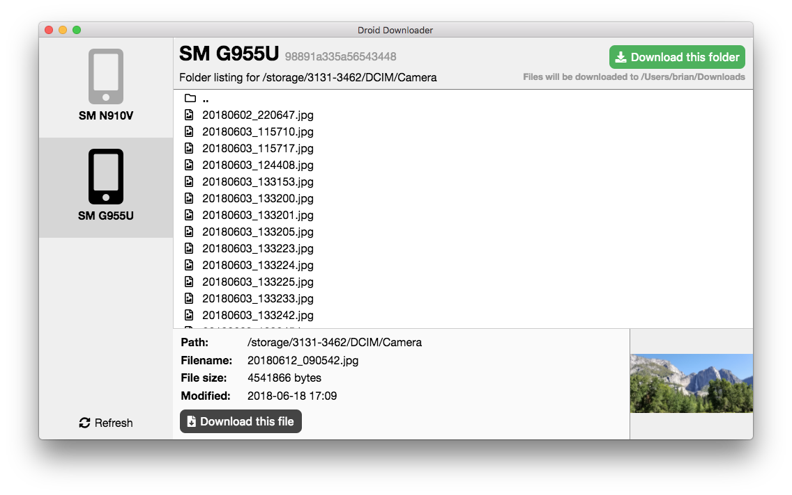

# Droid Downloader

This is a (very) work-in-progress Electron app which provides an easier user
interface to download files and folders from an Android device. It uses the
Android Debug Bridge (ADB) command line tool to interact with Android devices.



## Developing

To run this app, you will need:

- ADB (`brew cask install android-platform-tools`)
- Node (`brew install node`)

Then you will need to clone the repository and run Yarn to start it:

```bash
git clone https://github.com/bsdavidson/droid-downloader.git
cd droid-downloader
yarn
yarn start
```
